# XSD-rs

[](https://travis-ci.com/Michael-F-Bryan/xsd-rs)

([API Docs])

Generate Rust types from an XML Schema.

## Project Structure

The fastest way to create a fully-fledged XSD parser and code generator is to
use existing tools in other languages to generate Rust code for parsing XSD. 
From there, the plan is to use the generated Rust parser to parse an XSD and
write a code generator in Rust.

This is often referred to as bootstrapping or self-hosting. If this makes your
brain hurt you aren't alone.

I've started things off by downloading the official 
[`XMLSchema.xsd`](./XMLSchema.xsd) from the W3C website and generating C# code
code for parsing an XSD to get us started.

The process will look something like:



<!--
```mermaid
%% The code used to generate the above diagram
stateDiagram

state "C# XSD Parser"  as CP
state "C# Code Generator" as CG
state "Crappy Rust XSD Parser" as RP1: The smallest possible parser we can generate with C#
state "Rust Code Generator" as RG: A code generator which uses our first parser's types as input
state "Better Rust XSD Parser" as RP2

CP - -> CG
CG - -> RP1
RP1 - -> CG
RP1 - -> RG
RG - -> RP2
RP2 - -> RG

note right of RP2: Officially self-hosted now!
```
-->

## License

This project is licensed under either of

 * Apache License, Version 2.0, ([LICENSE-APACHE](LICENSE-APACHE) or
   http://www.apache.org/licenses/LICENSE-2.0)
 * MIT license ([LICENSE-MIT](LICENSE-MIT) or
   http://opensource.org/licenses/MIT)

at your option.

### Contribution

Unless you explicitly state otherwise, any contribution intentionally
submitted for inclusion in the work by you, as defined in the Apache-2.0
license, shall be dual licensed as above, without any additional terms or
conditions.

[API Docs]: https://michael-f-bryan.github.io/xsd-rs